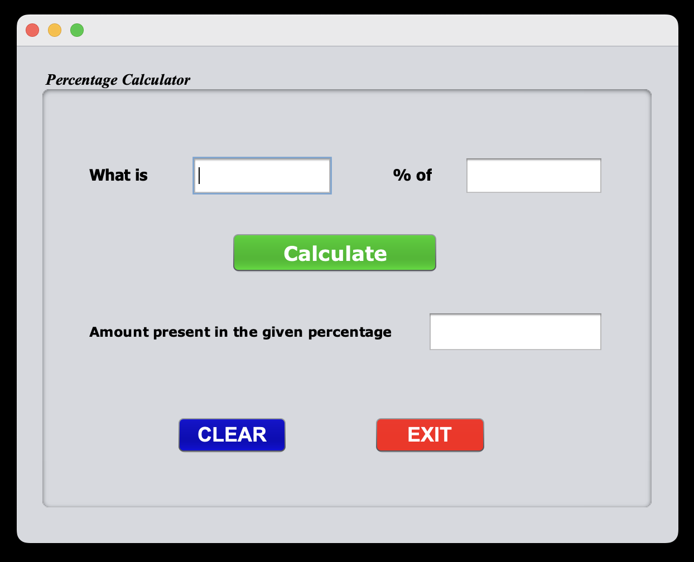
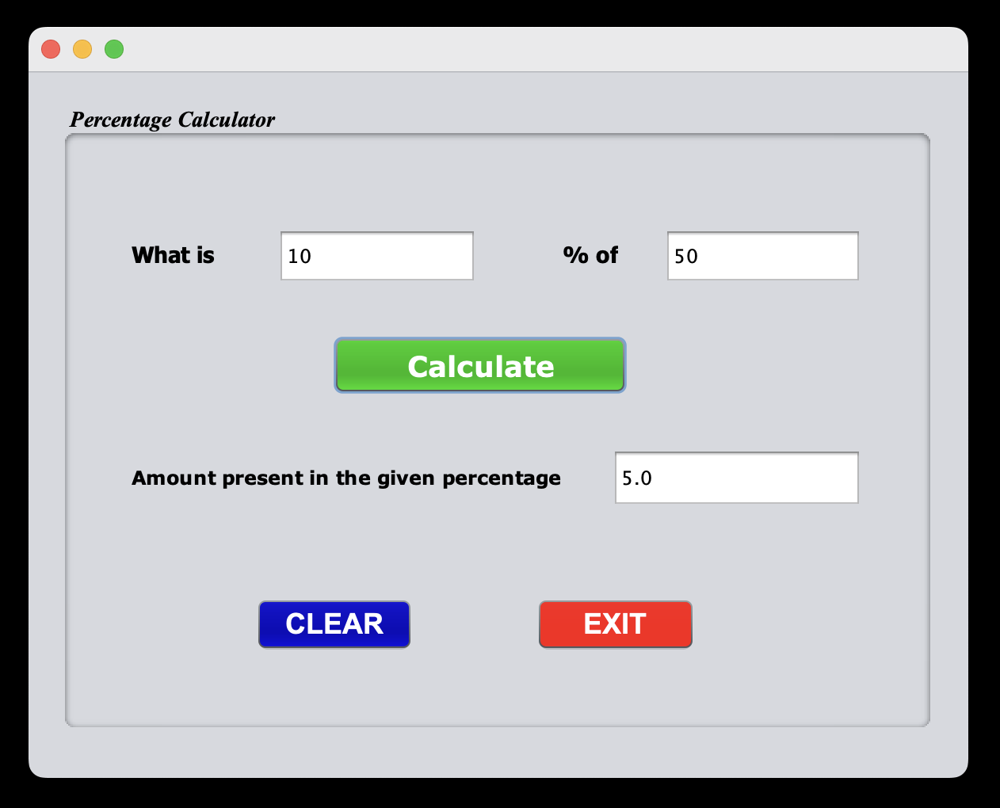

# 📊 Percentage Calculator

A simple Java Swing-based desktop application that calculates the **percentage value** of a number. This tool helps users quickly find "What is X% of Y" with a clear and intuitive user interface.

## ✨ Features

- User-friendly GUI developed with **Java Swing**
- Calculates:  
    What is X% of Y?
    => Result = (X / 100) * Y
- Real-time result display
- Includes **Calculate**, **Clear**, and **Exit** buttons

## 🖼️ Percentage Calculator GUI

### 📌 Initial State



### ✅ Example Calculation

> **Input:** What is `10%` of `50`  
> **Output:** `5.0`



## 📐 Percentage Formula

**Percentage** = (**X** / 100) × **Y**

Where:
- `X` is the percentage value
- `Y` is the base number

## 🚀 How to Run

### ✅ Option 1: Clone and Run Source Code

1. Clone the repository:
    ```bash
    git clone https://github.com/hema-priya-vadivel/PercentageCalculator.git

2. Open the project in a Java IDE (e.g., IntelliJ IDEA, Eclipse)

3. Compile and run Percentage.java from the src folder

4. Enter X and Y values and view the value of "What is X% of Y"

### ✅ Option 2: Download & Run Application Directly

If you don't want to clone the source code:

- [Download for Mac (.dmg)](https://github.com/hema-priya-vadivel/PercentageCalculator/blob/master/releases/download/PercentageCalculator-macOS-1.0.dmg)
